# ssid_resolver_flutter - "Get my Wifi Name"

A flutter plugin to resolve the SSID of the connected WiFi network, or simply: "Get my Wifi Name". 
For iOS and Android. This implementation uses the latest Android and iOS APIs as of January 2025.

This plugin is based on my two standalone implementations for iOS ([https://github.com/raoulsson/ssid-resolver-ios](https://github.com/raoulsson/ssid-resolver-ios))
and Android ([https://github.com/raoulsson/ssid-resolver-android](https://github.com/raoulsson/ssid-resolver-android)).

| Android                                                                                                                                     | iOS                                                                                                                                    |
|---------------------------------------------------------------------------------------------------------------------------------------------|----------------------------------------------------------------------------------------------------------------------------------------|
| 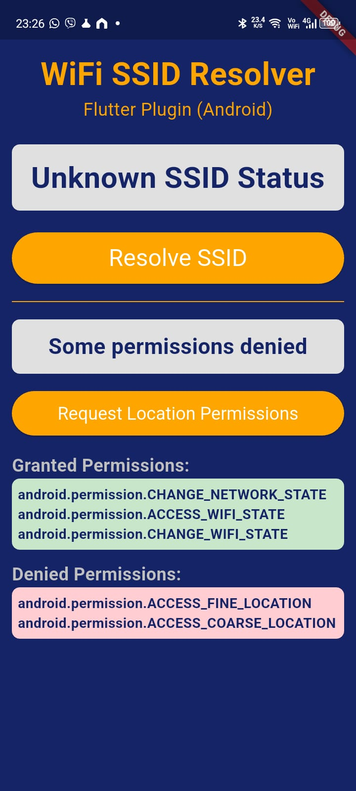<br />Not all permissions granted        | 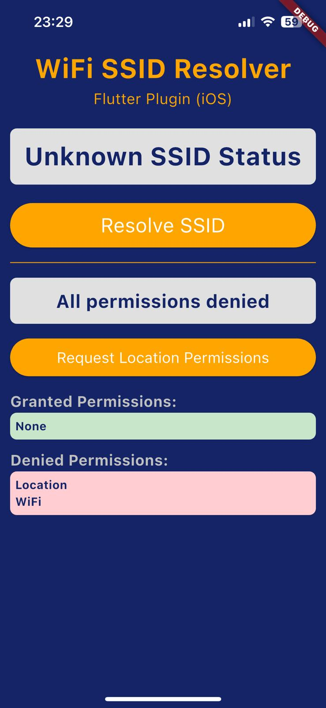<br />Not all permissions granted       |
| 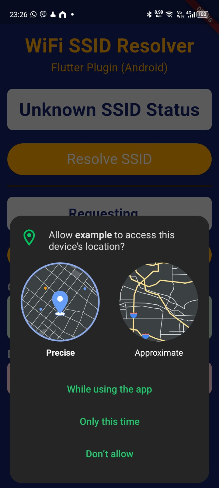<br />OS dialog to grant permissions  | 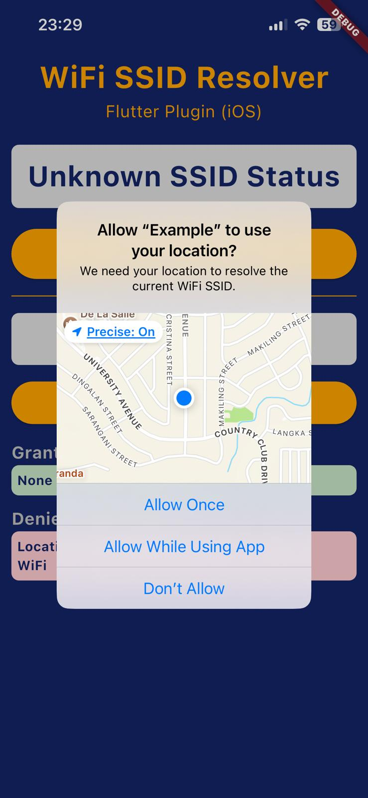<br />OS dialog to grant permissions |
| 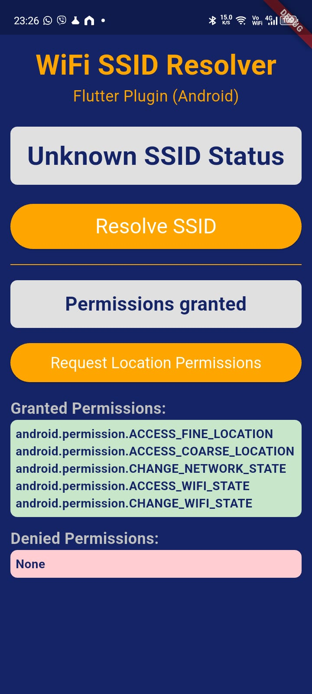<br />All permissions granted                | 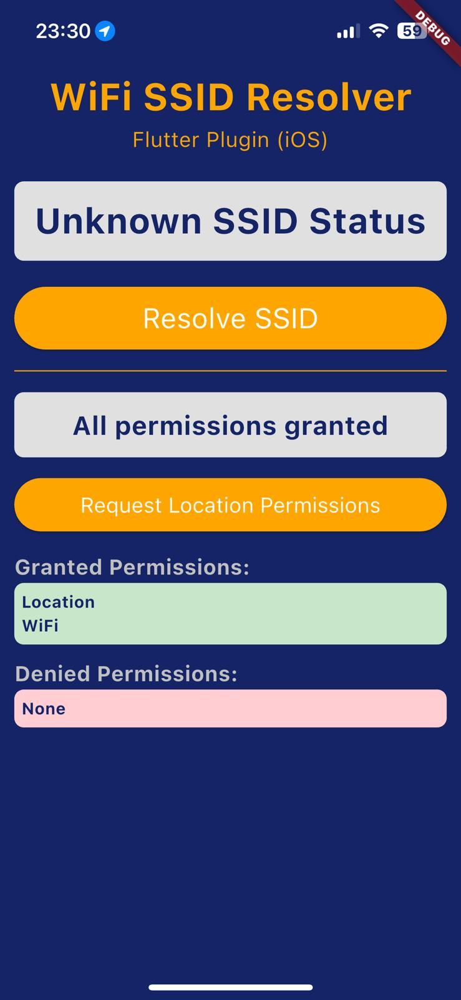<br />All permissions granted               |
| 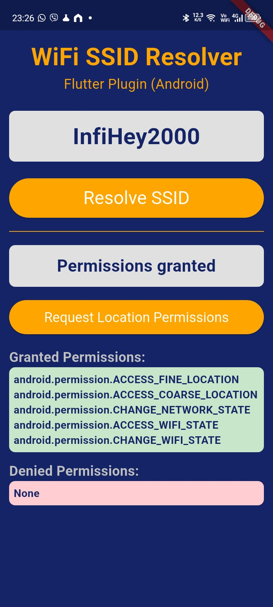<br />Network SSID resolved                    | 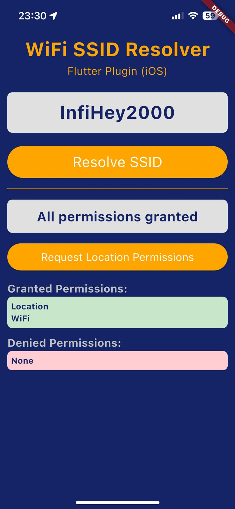<br />Network SSID resolved                   |


## Configuration and Example App

In the subfolder `example` you can find an example app that uses this plugin. The important configuration parts for iOS and Android are listed below.

### iOS

Needs these permissions in the `Info.plist` file:

```xml
    <key>NSLocationWhenInUseUsageDescription</key>
    <string>This app needs access to location to determine the WiFi information.</string>
    <key>NSLocationUsageDescription</key>
    <string>This app needs access to location to determine the WiFi information.</string>
    <key>NSLocationAlwaysAndWhenInUseUsageDescription</key>
    <string>This app needs access to location to determine the WiFi information.</string>
    <key>com.apple.developer.networking.wifi-info</key>
    <true/>
```

And also the "Access WiFi Information". Eith open `<project_root>/ios/Runner/Runner.xcodeproj` in XCode 
and go to "Signing & Capabilities". Add the "Access WiFi Information" capability.

| Add WiFi Capability 1                                                              | Add WiFi Capability 2                                                              |
|------------------------------------------------------------------------------------|------------------------------------------------------------------------------------|
| 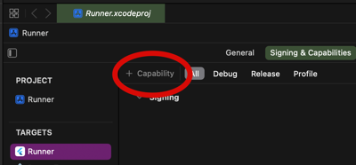 | 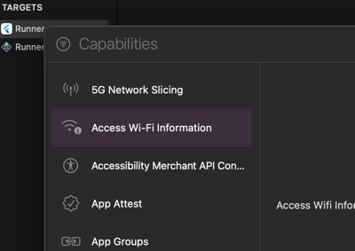 |      


This should produce the file `<project_root>/ios/Runner/Runner.entitlements` with this content:

```xml
<?xml version="1.0" encoding="UTF-8"?>
<!DOCTYPE plist PUBLIC "-//Apple//DTD PLIST 1.0//EN" "http://www.apple.com/DTDs/PropertyList-1.0.dtd">
<plist version="1.0">
<dict>
    <key>com.apple.developer.networking.wifi-info</key>
    <true/>
</dict>
</plist>
```

### Android

For Android, the `AndroidManifest.xml` file needs these permissions: 

```xml
    <uses-permission android:name="android.permission.ACCESS_FINE_LOCATION" />
    <uses-permission android:name="android.permission.ACCESS_COARSE_LOCATION" />
    <uses-permission android:name="android.permission.CHANGE_NETWORK_STATE" />
    <uses-permission android:name="android.permission.ACCESS_WIFI_STATE" />
    <uses-permission android:name="android.permission.CHANGE_WIFI_STATE" />
```

And also the following queries:

```xml
    <queries>
        <package android:name="com.google.android.gms" />
        <package android:name="com.android.settings" />
    </queries>
```

# Usage

To use this plugin, add `ssid_resolver_flutter` as a [dependency in your pubspec.yaml file](https://flutter.dev/docs/development/packages-and-plugins/using-packages).

The main method is `resolveSSID()` returns the SSID of the connected WiFi network or 'Unknown' if the SSID could not be resolved or an error occurred. The other two methods 
`checkPermissionStatus()` and `requestPermission()` are provided to give information about missing permissions. They are useful to find out which hard coded permissions might be missing and 
for the location permissions, to know if the user has granted them. 
Note that the WiFi permission on the iOS is also not granted, before the user has given access to the location services, even though the capability is set in the XCode project (see above).
So the basic flow should be to check the permission status and then request the permission if needed. After that, the SSID can be resolved.

## Involved Example

It's quite complicated to get the permissions and continue the flow, because the OS opens it's own 
modal dialog and the later returns to the app. The involved implementation can be found in 
`main_involved_usage_example.dart` in the example app:

```dart
// example/lib/main_involved_usage_example.dart
import 'dart:async';

import 'package:flutter/material.dart';
import 'package:ssid_resolver_flutter/ssid_resolver_flutter.dart';

/// Example class to demonstrate how to use the SSID Resolver plugin. You need
/// the WidgetsBindingObserver and the state variable _isRequestingPermission to
/// handle the permission request flow.
/// If this looks too complicated, consider using the SimpleUsageExample.
void main() {
  runApp(const InvolvedUsageExample());
}

class InvolvedUsageExample extends StatefulWidget {
  const InvolvedUsageExample({super.key});

  @override
  State<InvolvedUsageExample> createState() => _InvolvedUsageExampleState();
}

class _InvolvedUsageExampleState extends State<InvolvedUsageExample> with WidgetsBindingObserver {
  final _ssidResolver = SsidResolver();
  String _ssid = '';
  bool _isRequestingPermission = false;
  Timer? _permissionCheckTimer;

  @override
  void initState() {
    super.initState();
    WidgetsBinding.instance.addObserver(this);
  }

  @override
  void dispose() {
    _permissionCheckTimer?.cancel();
    WidgetsBinding.instance.removeObserver(this);
    super.dispose();
  }

  @override
  void didChangeAppLifecycleState(AppLifecycleState state) {
    if (state == AppLifecycleState.resumed && _isRequestingPermission) {
      _checkPermissionAndContinue();
    }
  }

  Future<void> _checkPermissionAndContinue() async {
    _permissionCheckTimer?.cancel();
    _isRequestingPermission = false;

    final permissionStatus = await _ssidResolver.checkPermissionStatus();
    if (permissionStatus.isGranted) {
      final ssid = await _ssidResolver.resolveSSID();
      setState(() => _ssid = ssid);
    } else {
      setState(() => _ssid = "Permission denied");
    }
  }

  Future<void> _getSSID() async {
    setState(() => _ssid = "Checking permissions...");

    final initialStatus = await _ssidResolver.checkPermissionStatus();
    if (initialStatus.isGranted) {
      final ssid = await _ssidResolver.resolveSSID();
      setState(() => _ssid = ssid);
      return;
    }

    _isRequestingPermission = true;
    await _ssidResolver.requestPermission();

    // Check immediately in case no modal was shown
    await Future.delayed(const Duration(milliseconds: 100));
    if (!_isRequestingPermission) return;

    await _checkPermissionAndContinue();

    // Set up periodic checks in case the app didn't lose focus
    _permissionCheckTimer = Timer.periodic(
      const Duration(milliseconds: 100),
          (_) => _checkPermissionAndContinue(),
    );
  }

  @override
  Widget build(BuildContext context) {
    return MaterialApp(
      home: ...
    );
}
```

## Simple Example

Usually, the location permission dialog is only shown once and the user can grant the permission. 
It is therefore not necessary to handle the permission request flow in the app on one click of a 
button / one request of a method. 

|                                                                                                                                            |                                                                                                                                                  |
|--------------------------------------------------------------------------------------------------------------------------------------------|--------------------------------------------------------------------------------------------------------------------------------------------------|
| 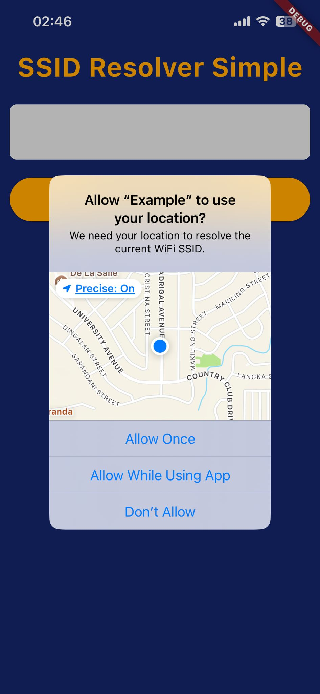<br /> Permission request on startup   | 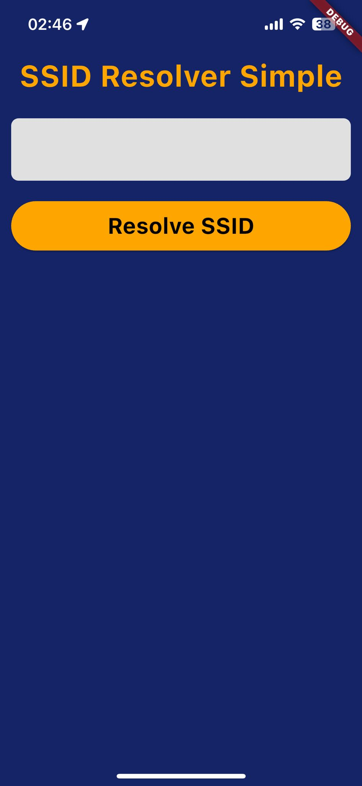<br /> Permissions now granted of denied |      
| 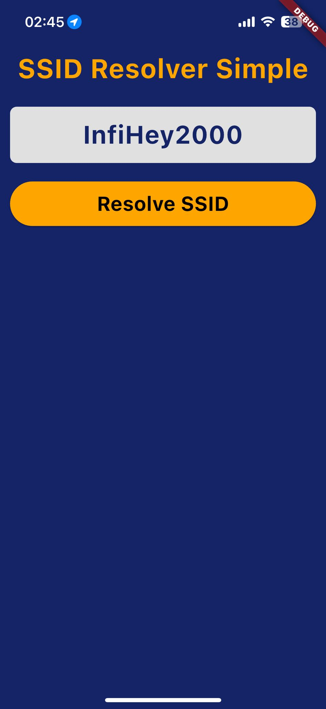<br /> Subsequent calls return result |                                                                                                                                                  |      


Therefore we can simplify the usage of the plugin by triggering the
permission request on app startup and then simply resolve the SSID later on in the code. For this you 
can use the helper class `SSIDManager`:

```dart
final _ssidManager = SSIDManager();
```

On initialization, the permission status is checked. Add `_ssidManager.initialize();` to your `initState` method:

```dart
@override
void initState() {
    super.initState();
    _ssidManager.initialize();
}
```

And later, on button click, the permission is requested and the SSID is resolved:

```dart
Future<void> _resolveSSID() async {
    if (await _ssidManager.requestPermissionIfNeeded()) {
      final ssid = await _ssidManager.getSSID();
      setState(() => _ssid = ssid ?? 'Unknown');
    } else {
      setState(() => _ssid = 'Permission denied');
    }
}
```

The `SSIDManager` class is a helper class that encapsulates the plugin methods and provides a simple 
way to get the SSID. It also provides a method to request the permission if needed.

Here is the source code of the `SSIDManager` class:

```dart
import 'package:flutter/material.dart';
import 'package:ssid_resolver_flutter/ssid_resolver_flutter.dart';

/// Helper class to manage the SSID resolution and permission handling.
/// The permission request flow is triggered "on-startup" when calling the initialize method.
/// Subsequent calls to getSSID will return the SSID if the permission is granted.
class SSIDManager with WidgetsBindingObserver {
  final _ssidResolver = SsidResolver();
  bool _initialized = false;
  bool _permissionGranted = false;

  /// Initializes the SSIDManager and triggers the permission request flow.
  /// Call this in your Widget's initState method. It will instantly open the 
  /// permission dialog handled by the OS.
  Future<void> initialize() async {
    if (_initialized) return;

    WidgetsBinding.instance.addObserver(this);
    await _checkPermission();
    if (!_permissionGranted) {
      await requestPermissionIfNeeded();
    }
    _initialized = true;
  }

  Future<void> _checkPermission() async {
    final status = await _ssidResolver.checkPermissionStatus();
    _permissionGranted = status.isGranted;
  }

  Future<bool> requestPermissionIfNeeded() async {
    if (_permissionGranted) return true;

    final status = await _ssidResolver.requestPermission();
    _permissionGranted = status.isGranted;
    return _permissionGranted;
  }

  Future<String?> getSSID() async {
    if (!_permissionGranted) return null;
    return _ssidResolver.resolveSSID();
  }

  void dispose() {
    WidgetsBinding.instance.removeObserver(this);
  }

  @override
  void didChangeAppLifecycleState(AppLifecycleState state) {
    if (state == AppLifecycleState.resumed) {
      _checkPermission();
    }
  }
}
```

If you run into permissions issues, make sure to check the permissions in the `AndroidManifest.xml` 
and `Info.plist` files as described above and try running the app on a real device instead of the emulator. 
iOS will not give you a SSID on the simulator. 

Also run the example app: main_full_debug_app.dart. That should show which permissions are missing.

I hope this helps.

# License

Copyright 2025 Raoul Marc Schmidiger (hello@raoulsson.com)

Permission is hereby granted, free of charge, to any person obtaining a copy of this software and associated documentation files (the “Software”), to deal in the Software without restriction, including without limitation the rights to use, copy, modify, merge, publish, distribute, sublicense, and/or sell copies of the Software, and to permit persons to whom the Software is furnished to do so, subject to the following conditions:

The above copyright notice and this permission notice shall be included in all copies or substantial portions of the Software.

THE SOFTWARE IS PROVIDED “AS IS”, WITHOUT WARRANTY OF ANY KIND, EXPRESS OR IMPLIED, INCLUDING BUT NOT LIMITED TO THE WARRANTIES OF MERCHANTABILITY, FITNESS FOR A PARTICULAR PURPOSE AND NONINFRINGEMENT. IN NO EVENT SHALL THE AUTHORS OR COPYRIGHT HOLDERS BE LIABLE FOR ANY CLAIM, DAMAGES OR OTHER LIABILITY, WHETHER IN AN ACTION OF CONTRACT, TORT OR OTHERWISE, ARISING FROM, OUT OF OR IN CONNECTION WITH THE SOFTWARE OR THE USE OR OTHER DEALINGS IN THE SOFTWARE.
